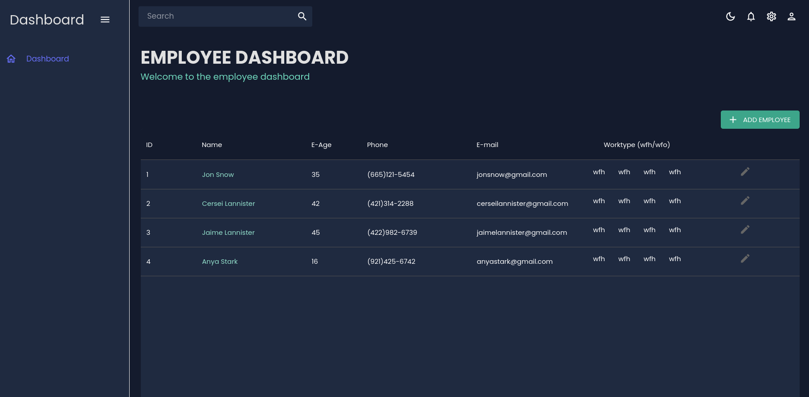

# Employee Dashboard

Welcome to the Employee Dashboard! This is a minimal setup for a dashboard to display employee information built using React, Vite, Material UI, Material UI Icons, React Router DOM, etc.

## Table of Contents

- [Employee Dashboard](#employee-dashboard)
  - [Table of Contents](#table-of-contents)
  - [About The Project](#about-the-project)
    - [Built With](#built-with)
  - [Getting Started](#getting-started)
    - [Prerequisites](#prerequisites)
    - [Installation](#installation)
  - [Screenshots](#screenshots)

## About The Project

The Employee Dashboard is a minimal setup for a dashboard to display employee information. It includes features like data sorting, and filtering. The application also includes CRUD operations locally. It is built using React, Vite, Material UI, Material UI Icons, React Router DOM, etc for rapid development.

### Built With

## Getting Started

To get a local copy up and running follow these simple steps.

### Prerequisites

You need to have Node.js and npm installed on your local machine. You can download Node.js from [here](https://nodejs.org/en/download/).

### Installation

1. Clone the repo

   

## Screenshots

